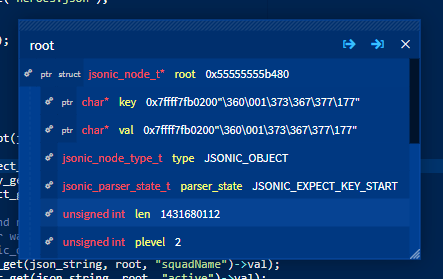
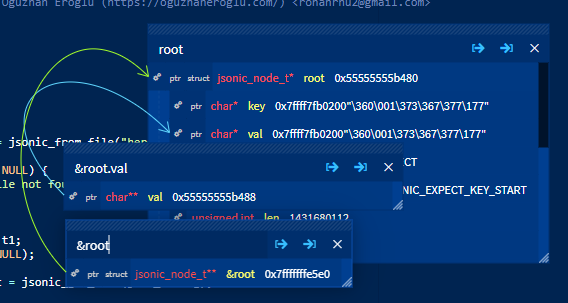
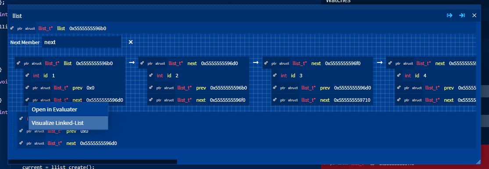
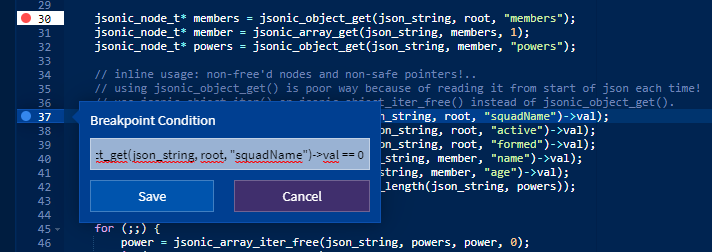
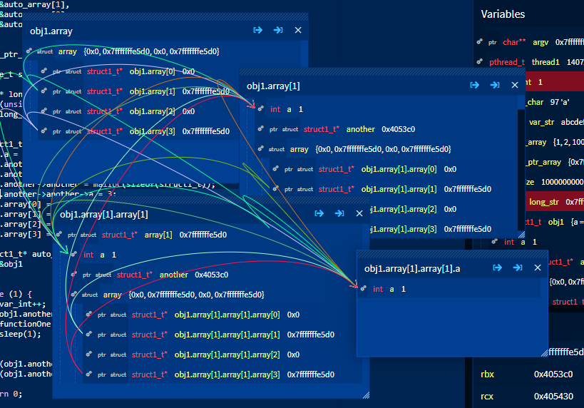
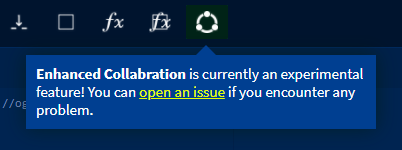
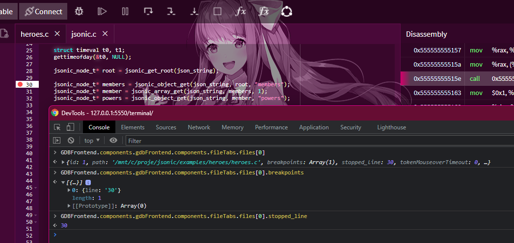
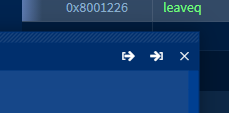

# [](https://oguzhaneroglu.com/projects/gdb-frontend/)

[](https://github.com/rohanrhu/gdb-frontend/releases)
[](https://github.com/rohanrhu/gdb-frontend/issues)
[](https://github.com/rohanrhu/gdb-frontend/network)
[](https://github.com/rohanrhu/gdb-frontend/stargazers)
[](https://discord.gg/RyVY9MtB4S)
[](https://patreon.com/EvrenselKisilik)
[](#%EF%B8%8F-donate)

GDBFrontend is an easy, flexible and extensionable gui debugger.


## Installing

### Requirements

* GDB => 8.2 (with python3)
* python3 => 3.2
* tmux

### PIP Package (Python Wheel) [Recommended]

You can install GDBFrontend with `pip`.

```bash
sudo python3 -m pip install gdbfrontend
```

if it is already installed and you are upgrading

```bash
sudo python3 -m pip install --upgrade gdbfrontend
```

or if you want to install specific GIT snapshot:

```bash
sudo python3 setup.py install
```

and you can run

```bash
gdbfrontend
```

### Running From GIT

You can download latest source and run it.

You can run gdb-frontend with following commands:

```bash
git clone https://github.com/rohanrhu/gdb-frontend.git gdb-frontend
cd gdb-frontend
./gdbfrontend
```

and you can open it with:

```
http://127.0.0.1:5550/terminal/
```

or without terminal:

```
http://127.0.0.1:5550/
```

You can open GDB shell with the command:

```bash
tmux a -t gdb-frontend
```

### Arch Linux (AUR)

You can install Arch Linux package for Arch-based distributions. ([AUR Package](https://aur.archlinux.org/packages/gdb-frontend-bin/))

```bash
yay -S gdb-frontend-bin
```

and you can run it:

```bash
gdbfrontend
```

### Flatpak

Flatpak package is a TODO.

## [Embedded Debugging with GDBFrontend](https://rohanrhu.github.io/gdb-frontend/tutorials/embedded-debugging/)

Follow [this quick tutorial](https://rohanrhu.github.io/gdb-frontend/tutorials/embedded-debugging/) for debugging embedded devices with GDBFrontend.

## [Python C Extension Debugging with GDBFrontend](https://rohanrhu.github.io/gdb-frontend/tutorials/python-c-extension-debugging/)

Follow [this quick tutorial](https://rohanrhu.github.io/gdb-frontend/tutorials/python-c-extension-debugging/) for debugging native C Python extensions with GDBFrontend.

## [How to develop GDBFrontend plugins?](https://rohanrhu.github.io/gdb-frontend/tutorials/plugin-development/)

GDBFrontend has powerful and extensible APIs. Follow [this quick tutorial](https://rohanrhu.github.io/gdb-frontend/tutorials/plugin-development/) to learn developing GDBFrontend plugins.

## Features

### Expression Evaluter

GDBFrontend has an expression evaluater that you can use multiple in sametime.



### Pointer Visualisation



### Linked-List Visualization



### Conditional Breakpoints

Right click to a breakpoint for setting its condition.




### Connected Expressions

Expressions of all variables, members and items are connected in GDBFrontend's VariablesExplorer.



### Process Manager

You can watch, filter or manage processes with Process Manager.


### Enhanced Collabration

GDBFrontend has a set of some features for collabration named as "Enhanced Collabration".



#### Collabration Draw

Collabration draw is available when you enable Enhanced Collabration. Click to Draw or use **Ctrl + Shift + X** shortcut to draw and **Ctrl + Shift + C** to clear all drawings.


#### Synced Source Viewing

With Enhanced Collabration all debugger clients are synchronized on source viewing.

### Expression hover popup variable explorer


### Extensibility

GDBFrontend is very extensible and has powerful APIs. Some examples of GDBFrontend's extensibility.




## `./gdbfrontend`

```bash
$ gdbfrontend --help
GDBFrontend is a easy, flexible and extensionable gui debugger.

Options:
  --help, -h:                                   Shows this help message.
  --version, -v:                                Shows version.
  --gdb-args="ARGS", -G "ARGS":                 Specifies GDB command line arguments. (Optional)
  --gdb-executable=PATH, -g PATH:               Specifies GDB executable path (Default is "gdb" command on PATH environment variable.)
  --tmux-executable=PATH, -tmux PATH:           Specifies Tmux executable path (Default is "tmux" command on PATH environment variable.)
  --terminal-id=NAME, -t NAME:                  Specifies tmux terminal identifier name (Default is "gdb-frontend".)
  --credentials=USER:PASS, -c USER:PASS:        Specifies username and password for accessing to debugger.
  --host=IP, -H IP:                             Specifies current host address that you can access via for HTTP and WS servers.
  --listen=IP, -l IP:                           Specifies listen address for HTTP and WS servers.
  --port=PORT, -p PORT:                         Specifies HTTP port. (0 for random port.)
  --readonly, -r:                               Makes code editor readonly. (Notice: This option is not related to security.)
  --workdir, -w:                                Specifies working directory.
  --plugin-dir, -P:                             Specifies plugins directory.
  --dontopenuionstartup, -D:                    Avoids opening UI just after startup.
  --verbose, -V:                                Enables verbose output.
```

### Options

#### `--help`, `-h`

Shows help text.

#### `--version`, `-v`

Shows version.

#### `--gdb-args="ARGS", -G "ARGS"`

Specifies GDB command line arguments. (Optional)

#### `--gdb-executable=PATH`, `-g PATH`

You can specify GDB executable path like `gdbfrontend --gdb-executable=/path/to/gdb`. (Optional)

#### `--tmux-executable=PATH`, `-tmux PATH`

You can specify Tmux executable path like `gdbfrontend --tmux-executable=/path/to/tmux`. (Optional)

#### `--terminal-id=PATH`, `-t PATH`

You can specify Tmux terminal id like `gdbfrontend --terminal-id=terminal-name`. (Default: `gdb-frontend`)

#### `--credentials=USER:PASS`, `-c USER:PASS`

Specifies username and password for accessing to debugger.

#### `--host=IP`, `-H IP`

Specifies current host address that you can access via for HTTP and WS servers.

#### `--listen=IP`, `-l IP`

Specifies listen address for HTTP and WS servers.

#### `--port=PORT`, `-p PORT`

Specifies HTTP port. (0 for random port.)

#### `--readonly, -r`

Makes code editor readonly. (Notice: This option is not related to security.)

#### `--workdir, -w`

Specifies working directory.

#### `--plugin-dir, -P`

Specifies plugins directory.

#### `--dontopenuionstartup`, `-D`

Avoids opening UI just after startup.

#### `--verbose`, `-V`

Enables verbose output.

### GDB Commands

GDBFrontend's GDB commands starts with `gf-`.

#### `gf-refresh`

Refreshes all browser clients.

#### `gf-theme [theme-name]`

Switch to desired theme. For example: `gf-theme light`, `gf-theme red` or `gf-theme default` for default theme.

#### `gf-list-plugins`

Lists all GDBFrontend plugins in the plugin directory.

#### `gf-load-plugin [plugin-name]`

Loads GDBFrontend plugin.

#### `gf-unload-plugin [plugin-name]`

Unloads GDBFrontend plugin.

## Shortcuts / Hotkeys

Current hotkeys are listed below.

| Action                                               | Hotkey                     | Context                                      |
| ---------------------------------------------------- | -------------------------- | -------------------------------------------- |
| *General:* Open a source file                        | **Ctrl + O**               | GDBFrontend                                  |
| *General:* New ExpressionEvaluater                   | **Ctrl + R**               | GDBFrontend                                  |
| *General:* New ExpressionEvaluter on native window   | **Ctrl + Shift + R**       | GDBFrontend                                  |
| *General:* Fuzzy source finder                       | **Ctrl + P**               | GDBFrontend                                  |
| *Runtime:* Run                                       | **F5**                     | GDBFrontend                                  |
| *Runtime:* Continue                                  | **F6**                     | GDBFrontend                                  |
| *Runtime:* Pause/Interrupt                           | **F7**                     | GDBFrontend                                  |
| *Runtime:* Step Over                                 | **F8**                     | GDBFrontend                                  |
| *Runtime:* Step Into                                 | **F9**                     | GDBFrontend                                  |
| *Runtime:* Step Instruction                          | **F10**                    | GDBFrontend                                  |
| *Runtime:* Stop                                      | **F11**                    | GDBFrontend                                  |
| *Enhanced Collabration:* Toggle drawing mode         | **Ctrl + Shift + X**       | GDBFrontend / Enhanced Collabration: Enabled |
| *Enhanced Collabration:* Clear all drawings          | **Ctrl + Shift + C**       | GDBFrontend / Enhanced Collabration: Enabled |

## Themes

GDBFrontend has built-in themes.

For switching between themes use `gf-theme [THEME]` command on GDB shell.

```
(gdb) gf-theme doki
(gdb) gf-theme sky
(gdb) gf-theme cyberpunk
(gdb) gf-theme dark
(gdb) gf-theme green
(gdb) gf-theme light
(gdb) gf-theme red
```

For switching back to the default theme.

```
(gdb) gf-theme
```

Also you may want to look to [Plugin Development Tutorial](https://github.com/rohanrhu/gdb-frontend/wiki/Plugin-Development-Tutorial).

## GDBFrontend Python API

You can access GDBFrontend's Python API via `gdbfrontend` module.

```
(gdb) python-interactive
```

```python
>>> dir(gdbfrontend)
```

For example, you can get all client sockets like this:

```python
>>> gdbfrontend.api.globalvars.httpServer.ws_clients
{1: <server.GDBFrontendSocket object at 0x...>}
```

or you can get all plugins:

```python
>>> gdbfrontend.plugin.getAll()
['hello', 'theme_light', 'theme_red']
```

## Security with Sharing Sessions

You can use `--credentials=USER:PASS` option for adding HTTP authentication to your debugger session.

## Browser Compatibility

GDBFrontend is mainly developing with testing on Chromium-based browsers. It will work properly with other browsers especially with Firefox but if you face some problems on other browsers, you can [send a bug-report](https://github.com/rohanrhu/gdb-frontend/issues/new).

## Troubleshooting

### Blocking GDB shell/main-thread

Most of GDBFrontend functions are thread-safe and work on GDB's main-thread. So, if you run something that is blocking on the GDB shell, GDBFrontend functions have to wait it until finish.

You will get this warning when a thread-safe GDBFrontend function needs to work and you are blocking GDB's main thread.

```bash
(gdb) shell
$ ...
```


When you exit shell, blocking GDBFrontend functions will continue working.

**Note:** Sometimes you may get this warning without running anything in GDB shell, it means something (in GDB's event-loop) is taking a long time; in this case just ignore this warning.

### Zombie Processes

GDBFrontend sends SIGTERM to its sub-processes, your application and its sub-processes.
If your application is forking new processes and setting their PGIDs, GDBFrontend may not close them. In this case you should send SIGKILL to your processes.

```bash
pkill -f gdb
```

### Expression Evaluater Performance Tips

If you are using **ExpressionEvaluater** with very long depth expanded variables/members, your scroll and evaluater window move performance may be affected bad for pointer visualization. In this situation, you can turn off **signal** and **slot** pointings for that evaluater window.



## GDB-Related Issues and Tips

* GDB may not give sources of dynamic linked object **until stepping a line that calls a function from the dynamic linked object once**.
  You can add break point a line and step it once, then you will see sources from dynamic linked object hereafter during the session.

## Windows

In fact, gdb-frontend is able to run on Windows but there are some serious issues in the GDB's Windows version those avoid using gdb-frontend on Windows. Of course you can use gdb-frontend on WSL if you are using Windows 10.

### Issues about Windows-GDB

* GDB's main-thread is being blocked during running process. (gdb-frontend has an interrupting mechanism to fixing this but it is not enough yet.)
* Windows-GDB's prompt is being blocked during running process and there are some issues about interrupting the application.

## WSL

You can use gdb-frontend on WSL (Windows Subsystem for Linux).

### Issues about WSL

* On WSL 1, Random port option is not usable on WSL becasue`/proc/net/tcp` interface is not working on WSL. (WSL 2 does not has this problem.)

## Versioning

Since v0.2.0-beta, GDBFrontend switched to a new versioning strategy.

### Reading Versions

In `vX.Y.Z-STABILITY`:

* `X` is**major** versions, changes long term with major features and enhancements.
* `Y` is**main** versions that include new features and enhancements.
* `Z` is**bugfix** releases of main versions.
* `STABILITY` is stability level of the release. (`alpha`,`beta`,`rcN`,`stable`)

## Documentation

Documentation is TODO yet.

## API Documentation

API Documentation is TODO yet.

## Plugin Development

You can read the [Plugin Development Tutorial](https://github.com/rohanrhu/gdb-frontend/wiki/Plugin-Development-Tutorial).

## Theme Development

Themes are developed as plugins.

## Discord

Join to Discord community.

[](https://discord.gg/RyVY9MtB4S)

## 🎊 Contributing

You can contribute with commiting to project or developing a plugin. All commits are welcome.

## ❤️ Donate

### Patreon

[](https://patreon.com/EvrenselKisilik)

### Bitcoin

You can donate to support the project.

| QR Code                                                        | Bitcoin address for donations                |
| -------------------------------------------------------------- | -------------------------------------------- |
|  | **3KBtYfaAT42uVFd6D2XFRDTAoErLz73vpL** |

## License

Copyright (C) 2019, Oğuzhan Eroğlu <rohanrhu2@gmail.com> (https://oguzhaneroglu.com/)

GNU General Public License v3 (GPL-3)

You may copy, distribute and modify the software as long as you track changes/dates in source files. Any modifications to or software including (via compiler) GPL-licensed code must also be made available under the GPL along with build & install instructions.
